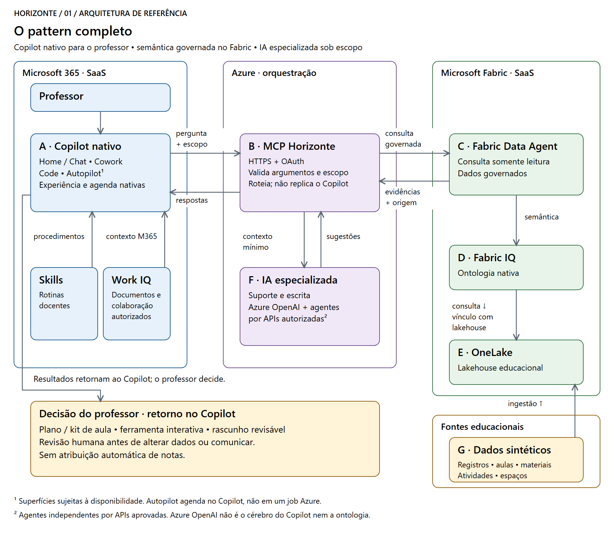
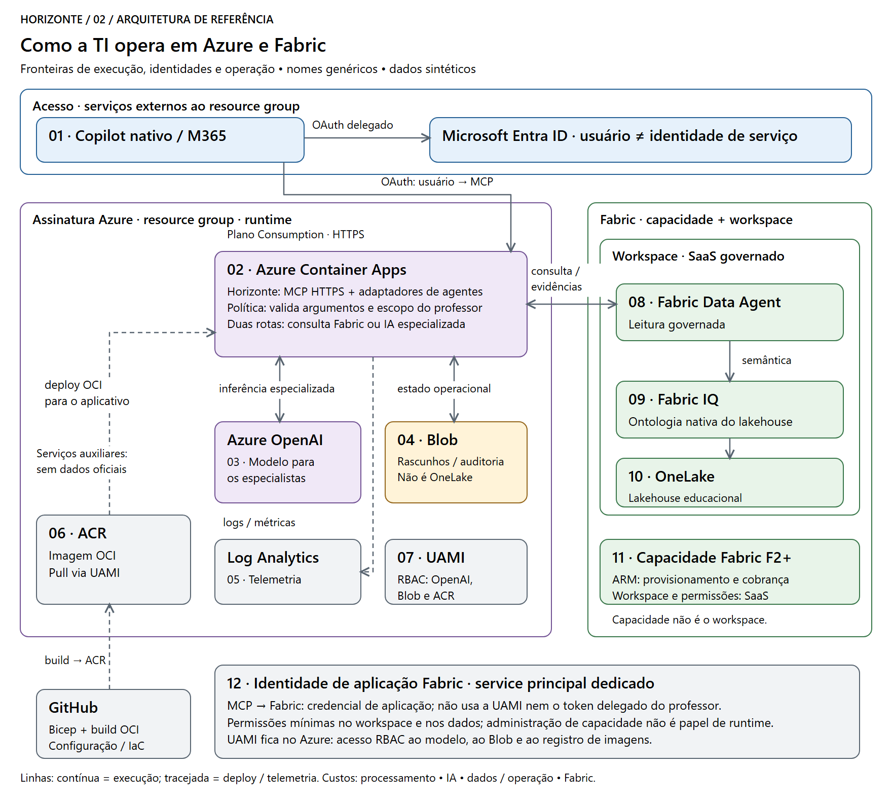

Horizonte | AI para quem ensina
===============================

**Uma experiência para o professor. Vários sistemas trabalhando juntos.
Decisões pedagógicas continuam humanas.**

Horizonte demonstra como o **Copilot nativo** pode conectar dados, materiais e
agentes educacionais para preparar aulas, resolver dúvidas de suporte e criar
ferramentas úteis ao professor. A base é uma **ontologia nativa no Fabric IQ**,
consultada por um **Fabric Data Agent** e integrada por **skills e MCP no Azure**.

Este documento explica a arquitetura final de referência, suas responsabilidades
e seus contratos. O desenho não é um inventário de recursos provisionados.
Os exemplos usam somente dados sintéticos e sistemas educacionais genéricos.

Por que esse pattern interessa à TI de educação
-----------------------------------------------

O problema não é a falta de sistemas: é o professor precisar conectar sozinho
as informações entre eles. Uma aula depende de currículo, turma, evidências,
materiais, calendário e condições da escola. Nenhum chatbot isolado resolve
essa fragmentação com segurança.

.. list-table::
   :header-rows: 1
   :widths: 30 38 32

   * - Dor da operação educacional
     - Decisão de arquitetura
     - Resultado esperado
   * - Consultas e tarefas distribuídas por vários portais.
     - Copilot nativo como ponto de trabalho; MCP integra as capacidades.
     - Menos troca de contexto, sem criar outro portal docente.
   * - Cada sistema usa nomes, identificadores e métricas diferentes.
     - Ontologia Fabric IQ com conceitos, relações e origem dos dados.
     - Respostas explicáveis no vocabulário da educação.
   * - Agentes de IA resolvem apenas partes do problema.
     - Skills coordenam especialistas com contexto autorizado.
     - Reutilização dos investimentos, sem reescrever todos os agentes.
   * - Uma necessidade pequena vira demanda na fila de desenvolvimento.
     - Code nativo cria ferramentas delimitadas e governadas.
     - O professor adapta sua forma de trabalhar; a TI controla os acessos.
   * - Pendências só aparecem quando alguém as procura.
     - Autopilot nativo acompanha objetivos explicitamente autorizados.
     - Preparação antecipada e rascunhos para revisão, não decisões autônomas.

**O ganho proposto é capacidade de ação com contexto, não apenas geração de
texto.** Redução de tempo, qualidade e adoção devem ser medidas em um piloto;
não são resultados presumidos pela existência da arquitetura.

O pattern completo
------------------

`Abrir imagem vetorial <docs/images/horizonte-pattern.svg>`_ |
`Editar diagrama no Excalidraw <docs/images/horizonte-pattern.excalidraw>`_

**Leia o desenho como uma separação de responsabilidades:**

1. **Microsoft 365 é onde o professor trabalha.** Chat conversa, Cowork prepara
   entregáveis, Code cria ferramentas e Autopilot acompanha objetivos.
   As skills ensinam o procedimento; não são uma interface substituta.
2. **Azure conecta e controla.** A API MCP valida identidade, escopo e
   parâmetros; encaminha consultas ao Fabric e pedidos aos agentes especialistas.
3. **Fabric dá significado aos dados.** O Data Agent consulta fontes governadas
   usando a ontologia nativa; a resposta conserva as evidências disponíveis.
4. **Sistemas de origem continuam donos dos registros.** Diário, atividades,
   materiais e gestão de espaços não são substituídos pelo Copilot.
5. **A resposta volta ao professor.** Fatos, sugestões e artefatos são
   apresentados juntos, com revisão antes de qualquer efeito externo.

A linha principal é **Copilot → skills/MCP → Fabric Data Agent → ontologia
Fabric IQ → dados governados**. A consulta percorre esse caminho; a atualização
dos dados percorre outro: **fontes → ingestão ou acesso federado → OneLake**.

Agentes especialistas formam uma ramificação coordenada pelas skills/MCP.
O Data Agent não é um executor genérico de agentes externos. Work IQ adiciona
contexto autorizado do Microsoft 365; não é um banco de dados escolar.

Quem faz o quê — e o que entrega
--------------------------------

.. list-table::
   :header-rows: 1
   :widths: 19 24 30 27

   * - Componente
     - Entrada
     - Responsabilidade
     - Saída / output
   * - **Copilot nativo**
     - Objetivo do professor e contexto autorizado.
     - Conduzir a interação, delegar trabalho e compor resultados.
     - Explicação, plano de aula, documento, ferramenta ou rotina autorizada.
   * - **Skills educacionais**
     - Tipo de tarefa, limites e ferramentas disponíveis.
     - Definir procedimento, consultar evidências e escolher especialistas.
     - Sequência de trabalho e critérios de revisão.
   * - **Servidor MCP no Azure**
     - Identidade autenticada e chamada de ferramenta com parâmetros.
     - Validar acesso, aplicar contratos e encaminhar a execução.
     - Resultado estruturado ou erro explícito; nunca permissão implícita.
   * - **Fabric Data Agent**
     - Pergunta e acesso autorizado às fontes.
     - Consultar os dados por meio da semântica e das fontes configuradas.
     - Resposta fundamentada e evidências disponíveis para conferência.
   * - **Ontologia Fabric IQ**
     - Entidades, chaves, relações e bindings das fontes.
     - Expressar significado e ligações entre conceitos educacionais.
     - Modelo semântico navegável: quem, o quê, como se relaciona e de onde vem.
   * - **OneLake / Lakehouse**
     - Dados ingeridos ou acessados por mecanismos suportados.
     - Organizar tabelas, histórico, qualidade e atualização.
     - Dados governados com origem, período e esquema conhecido.
   * - **Agentes especialistas**
     - Pedido delimitado e contexto mínimo autorizado.
     - Apoiar uma função: suporte docente, escrita ou outra especialidade.
     - Sugestão, diagnóstico técnico ou rascunho com limites explícitos.
   * - **Work IQ / Microsoft 365**
     - Documentos e colaboração acessíveis ao usuário.
     - Acrescentar o contexto de trabalho autorizado.
     - Referências e materiais pertinentes à tarefa.
   * - **Professor + serviço executor**
     - Proposta, destino, conteúdo e versão exatos.
     - Aprovar; o executor valida autorização antes de eventual escrita.
     - Ação confirmada e auditável — ou apenas um rascunho, se não aprovada.

**Quatro outputs que não devem ser confundidos:** uma evidência é um fato
recuperado; uma sugestão é interpretação; um artefato é uma entrega utilizável;
uma execução é uma mudança confirmada em um sistema. Gerar texto não comprova
que um chamado foi aberto, uma mensagem enviada ou um diário atualizado.

Como a arquitetura se distribui em Azure e Fabric
-------------------------------------------------

`Abrir imagem vetorial <docs/images/horizonte-azure.svg>`_ |
`Editar diagrama no Excalidraw <docs/images/horizonte-azure.excalidraw>`_

**São três fronteiras de serviço, não uma única aplicação no Azure.**
Copilot opera no Microsoft 365; o backend de integração opera na assinatura
Azure; Data Agent, ontologia e Lakehouse são itens de um workspace Fabric.
A capacidade Fabric pode ser provisionada e cobrada pelo Azure, mas esses
itens não são containers dentro do Container Apps.

.. list-table::
   :header-rows: 1
   :widths: 24 42 34

   * - Serviço / local
     - Papel no desenho
     - O que a TI administra
   * - **Microsoft 365 Copilot**
     - Experiência nativa, plugin e contexto de trabalho.
     - Licenças, disponibilidade de capacidades, consentimento e políticas.
   * - **Azure Container Apps**
     - Hospeda MCP, adaptadores e serviços dos agentes de referência.
       Expõe HTTPS; não hospeda uma cópia do Copilot.
     - Revisões, escala, sondas, limites, configuração e identidades.
   * - **Azure OpenAI**
     - Inferência dos agentes de referência de suporte e escrita.
       Não é o modelo interno do Copilot nem a ontologia.
     - Deployment de modelo, quotas, tokens, filtros e localização do processamento.
   * - **Azure Blob Storage**
     - Estado operacional, rascunhos e trilha de ações do backend.
       Não é o Lakehouse nem o registro escolar oficial.
     - RBAC, retenção e concorrência por ETag.
   * - **Azure Container Registry**
     - Armazena a imagem versionada usada pelo Container Apps.
     - Builds, permissões de leitura, versões e política de imagens.
   * - **Azure Monitor / Log Analytics**
     - Telemetria operacional para localizar falhas e medir comportamento.
     - Alertas, correlação e retenção; sem segredos ou dados escolares em logs.
   * - **Capacidade + workspace Fabric**
     - Recursos de processamento e fronteira de organização dos itens.
     - Capacidade, papéis, configurações do tenant e acesso às fontes.
   * - **Fabric Data Agent + ontologia**
     - Consulta de negócio e semântica nativas.
     - Publicação, bindings, relações, atualização e qualidade das respostas.
   * - **OneLake / Lakehouse**
     - Camada governada de dados analíticos.
     - Tabelas, histórico, qualidade, contratos e frequência de atualização.
   * - **Microsoft Entra ID**
     - Identidade de usuário e de serviços, com permissões distintas.
     - Escopos, credenciais, consentimento, rotação e menor privilégio.

Perfil do laboratório e decisões de produção
~~~~~~~~~~~~~~~~~~~~~~~~~~~~~~~~~~~~~~~~~~~~~

Os templates usam **Container Apps Consumption**, 0,25 vCPU / 0,5 GiB e escala
de 0 a 1 réplica; **ACR Basic**, **Blob Standard LRS**, **Log Analytics** com
retenção de 30 dias e **Azure OpenAI GlobalStandard** para os especialistas.
Esse é um perfil de laboratório, não um dimensionamento de rede educacional.

App e armazenamento usam ``brazilsouth``; o recurso Azure OpenAI usa
``eastus2`` com processamento GlobalStandard. **A região do recurso não é
garantia de residência do processamento.** O uso demonstrativo é sintético;
dados reais exigem avaliação de localização, transferência e contratos.

A capacidade Fabric deve atender aos requisitos dos workloads e à concorrência
planejada. F2 é um ponto de entrada do laboratório, não uma promessa de
desempenho para produção. Escalar o app a zero não desliga a capacidade Fabric,
o ACR, o armazenamento nem os custos de inferência e do Copilot.

O backend tem ingresso HTTPS autenticado. **Autenticação não equivale a rede
privada:** private endpoints, WAF, API Management ou alta disponibilidade são
decisões de produção a avaliar, não garantias implícitas deste desenho.

O repositório GitHub guarda código, skills, definições e infraestrutura como código.
CI valida mudanças; Bicep descreve os recursos Azure; scripts e definições
Fabric descrevem seus itens. O ciclo de publicação do plugin e o consentimento
no Microsoft 365 são separados do deployment do backend.

Ontologia: por que não basta um chatbot sobre tabelas
-----------------------------------------------------

Uma tabela pode dizer que uma sala está indisponível. A ontologia permite
relacionar essa sala às aulas, turmas, objetivos curriculares e materiais.
Assim, a pergunta deixa de ser “qual é o status da sala?” e passa a ser
**“qual aula será afetada e como preservar seu objetivo?”**

.. list-table::
   :header-rows: 1
   :widths: 38 62

   * - Relação de negócio
     - Pergunta que ela permite responder
   * - Professor → Turma → Aula
     - De qual trabalho e de qual escopo de acesso estamos falando?
   * - Aula → Habilidade curricular ← Atividade
     - O que se pretende desenvolver e qual atividade observa isso?
   * - Atividade → Evidência → Intervenção
     - Que fato sustenta a proposta de retomada?
   * - Aula → Espaço escolar / Material
     - Quais restrições e recursos afetam a preparação?
   * - Pendência → Aula / Registro
     - A causa é administrativa, pedagógica ou técnica?

A ontologia nativa no Fabric IQ mantém conceitos, chaves, relações e bindings.
O Data Agent deve ser publicado com o item de ontologia **EducationOntology**
explicitamente vinculado pela superfície nativa suportada. Selecionar somente
um Lakehouse ou Graph não equivale a essa integração. **Desenhar um grafo ou
copiar seu conteúdo para um prompt também não.** Vocabulário de negócio e
direção física das relações precisam ser mapeados explicitamente.

Cada evidência conserva fonte, período, granularidade, identificador e regra
aplicável. Métricas preservam numerador e denominador. Ausência de dados não
significa ausência de problema, e **presença, acesso ou conclusão de atividade
não provam aprendizagem**. Habilidade curricular é uma competência de
aprendizagem; skill de AI é um procedimento executável.

Exemplo ponta a ponta: o laboratório fechou
-------------------------------------------

**Pedido no Copilot:** “O laboratório ficou indisponível. Prepare uma alternativa
para a próxima aula, preservando o objetivo curricular e sem depender de internet.”

.. list-table::
   :header-rows: 1
   :widths: 13 45 42

   * - Etapa
     - O que acontece
     - Output que o professor ou a TI consegue conferir
   * - **1. Entender**
     - Copilot e skill identificam turma, aula e limites da tarefa.
     - Pedido delimitado; nenhuma leitura fora do escopo autorizado.
   * - **2. Fundamentar**
     - MCP consulta o Data Agent e a ontologia relaciona espaço, aula,
       habilidade e materiais.
     - Evidências com origem, período e relações utilizadas.
   * - **3. Especializar**
     - Um agente de suporte, se necessário, recebe apenas o contexto da pendência.
     - Triagem técnica e proposta de encaminhamento, não um chamado enviado.
   * - **4. Preparar**
     - Cowork compõe alternativas, instruções e uma atividade de saída.
     - Kit de aula editável, com opção offline e materiais seguros.
   * - **5. Adaptar**
     - Se solicitado, Code cria um organizador de estações a partir desse contexto.
     - Ferramenta ajustável pelo professor, sem credenciais embutidas.
   * - **6. Revisar**
     - O professor escolhe a alternativa e revisa qualquer proposta de comunicação.
     - Decisão humana; nenhum registro oficial alterado apenas por gerar o kit.

As etapas são um exemplo de contrato de execução, não uma transcrição de uma
consulta. Dados ausentes e falhas devem ser exibidos; não há resposta de
sucesso fabricada nem substituição silenciosa de uma fonte.

Outros cenários com impacto no dia a dia
----------------------------------------

**Suporte ao diário, sem preencher pelo professor**
   Relacionar calendário, aula realizada e pendência. Acionar o especialista
   de suporte e devolver passos verificáveis. Output: triagem e rascunho de
   encaminhamento, não frequência lançada.

**Recomposição de aprendizagem, sem rotular estudantes**
   Usar evidências por habilidade para propor estações e uma pergunta de saída.
   Output: plano revisável com agrupamentos pedagógicos temporários, não
   classificação fixa ou inferência clínica.

**Oficina de reescrita, não fábrica de notas**
   Conectar texto sintético, rubrica e sugestões do especialista.
   Output: feedback fundamentado e alternativas de revisão, não nota publicada.

**Ferramenta pequena, criada para um problema real**
   Usar Code nativo para construir um laboratório de frações, organizador de
   estações ou editor de rubricas. Output: artefato governado e ajustável;
   a necessidade não fica restrita a três widgets predefinidos.

**Preparação proativa da semana**
   Dar ao Autopilot nativo um objetivo, frequência, escopo e condição de parada.
   Output: evidências novas e rascunhos preparados para revisão. Uma skill não
   cria agenda por si só; um job Azure não é apresentado como Autopilot.

Integração sem substituir os sistemas de origem
-----------------------------------------------

**Dados estruturados:** ingestão materializa o que exige histórico e controle
de qualidade; federação ou shortcuts usam os mecanismos suportados pela fonte.
Não se presume que todos os sistemas possuam APIs abertas nem que toda
integração elimine cópias.

**Materiais e colaboração:** Microsoft 365 / Work IQ complementam a tarefa
com o contexto permitido ao usuário. Não constituem uma cópia irrestrita
dos documentos nem substituem o modelo semântico dos dados.

**Agentes existentes:** cada adaptador define API aprovada, autenticação,
escopo, esquema de entrada/saída, timeout e erro. O especialista recebe
contexto mínimo e retorna sua contribuição ao Copilot.

**Registros oficiais:** continuam nos sistemas transacionais. A demonstração
usa adaptadores sintéticos e agentes de referência; conectar serviços reais
exige contratos, autorização institucional e proteção de dados.

Como a TI governa e opera
-------------------------

Identidade e autorização em três fronteiras
~~~~~~~~~~~~~~~~~~~~~~~~~~~~~~~~~~~~~~~~~~~

1. **Copilot → MCP:** OAuth Entra delegado, configuração no
   ``OAuthPluginVault``, validação de emissor, audiência, expiração, escopo e
   usuário. O manifesto contém referência, nunca segredo.
2. **Backend → Azure:** identidade gerenciada atribuída pelo usuário (UAMI)
   e RBAC para modelo, armazenamento e imagens. Identidade técnica não
   substitui autorização docente.
3. **Backend → Fabric:** usuário delegado ou service principal suportado pelo
   Data Agent, com acesso próprio ao workspace e às fontes. A identidade
   gerenciada usada nos serviços Azure não é suportada nesse contrato de
   runtime do Data Agent. Um token do MCP não concede acesso automático ao
   Fabric; preferir menor privilégio no runtime.

O diagrama de implantação escolhe um service principal dedicado para o Fabric.
Nesse fluxo, o token do professor não é propagado automaticamente à fonte:
o escopo docente precisa de controle independente e verificável na camada de
acesso aos dados. Uma identidade de aplicação com acesso amplo não é isolada
por simplesmente mencionar a turma no prompt.

**Filtro em prompt não é controle de acesso.** O isolamento por professor,
turma e tenant deve existir nas fronteiras de autorização e de dados.
Credenciais ficam fora de código, artefatos, logs e conversas.

Revisão humana e proteção dos estudantes
~~~~~~~~~~~~~~~~~~~~~~~~~~~~~~~~~~~~~~~~

Antes de uma escrita real, mostrar destino, conteúdo exato, versão e efeito.
O serviço executor valida a aprovação e a permissão, evita duplicação e
registra o resultado. Sem confirmação, o output permanece um rascunho.

Finalidade, minimização, retenção e melhor interesse dos estudantes orientam
o uso de dados. Não inferir deficiência, condição clínica, contexto familiar
ou capacidade fixa. Documentos e saídas de agentes são dados não confiáveis,
não instruções para aumentar permissões ou executar comandos.

Responsabilidades operacionais
~~~~~~~~~~~~~~~~~~~~~~~~~~~~~~

* **Equipe pedagógica:** objetivos, rubricas, qualidade dos materiais e revisão.
* **Equipe de dados:** contratos, chaves, bindings, atualização e proveniência.
* **Equipe de integração/plataforma:** MCP, agentes, disponibilidade e deployments.
* **Segurança e administração M365/Fabric:** identidades, políticas e consentimento.
* **Operação e FinOps:** erros, latência, consumo, retenção e custo por tarefa.

Correlacionar uma solicitação entre MCP, Fabric e especialistas, registrando
metadados operacionais necessários — não o conteúdo integral de estudantes.
Falha de fonte, falta de permissão e recusa de execução devem ser distinguíveis.
Não há benefício em responder rápido com evidências erradas.

Impacto
-------

.. list-table::
   :header-rows: 1
   :widths: 25 42 33

   * - Dimensão
     - Indicador do piloto
     - Como interpretar
   * - Tempo docente
     - Tempo até um plano revisado e utilizável; quantidade de trocas de sistema.
     - Comparar tarefas equivalentes antes/depois; incluir o tempo de revisão.
   * - Qualidade pedagógica
     - Adequação ao objetivo, uso de evidências e esforço de correção pelo professor.
     - Avaliação humana com rubrica; não apenas satisfação com a resposta.
   * - Suporte
     - Triagens úteis, reincidência e encaminhamentos incompletos.
     - Não confundir resposta automática com problema resolvido.
   * - Confiança e segurança
     - Proveniência conferível, acessos negados e ações sem aprovação.
     - Tratar violação de permissão ou escrita não autorizada como falha de aceite.
   * - Operação e custo
     - Sucesso das chamadas, latência e custo por tarefa concluída.
     - Separar Copilot, capacidade Fabric, modelos e infraestrutura Azure.

O piloto deve começar com dados sintéticos, tarefas representativas e revisão
docente. Benefícios de aprendizagem requerem avaliação pedagógica apropriada;
não podem ser atribuídos automaticamente ao uso da ferramenta.

Pré-requisitos e documentação técnica
--------------------------------------

O pattern depende de capacidades nativas Copilot habilitadas, plugin autorizado,
workspace/capacidade Fabric adequados, ontologia e Data Agent publicados,
fontes governadas, conectividade e identidades com escopo correto.
A disponibilidade de uma superfície Copilot não garante as demais.

.. list-table::
   :header-rows: 1
   :widths: 35 65

   * - Quero entender…
     - Onde ler
   * - Instalação do plugin e consentimento
     - `Copilot nativo <docs/native-copilot.rst>`_
   * - Itens, bindings e consulta nativa
     - `Operação Fabric <docs/fabric-operations.rst>`_
   * - Templates e publicação no Azure
     - `Implantação <docs/deployment.rst>`_
   * - Roteiro de demonstração
     - `Cenários <docs/scenarios.rst>`_
   * - Medidores e dimensionamento
     - `Custos <docs/costs.rst>`_
   * - Contratos e governança para dados reais
     - `Produção <docs/production.rst>`_

Referências oficiais
--------------------

* `Copilot Home, Code e Autopilot
  <https://blogs.microsoft.com/blog/2026/09/25/introducing-the-new-copilot-with-home-code-and-autopilot/>`_.
* `Extensibilidade do Copilot
  <https://learn.microsoft.com/en-us/microsoft-365/copilot/extensibility/overview>`_.
* `Plugins Cowork
  <https://learn.microsoft.com/en-us/microsoft-365/copilot/cowork/cowork-plugin-development>`_.
* `OAuth para MCP
  <https://learn.microsoft.com/en-us/microsoft-365/copilot/extensibility/plugin-authentication-oauth>`_.
* `Ontologia e Fabric Data Agent
  <https://learn.microsoft.com/en-us/fabric/iq/ontology/tutorial-4-create-data-agent>`_.
* `MCP do Fabric Data Agent
  <https://learn.microsoft.com/en-us/fabric/data-science/data-agent-mcp-server>`_.
* `OneLake shortcuts
  <https://learn.microsoft.com/en-us/fabric/onelake/onelake-shortcuts>`_.

Código aberto à leitura, serviços protegidos
---------------------------------------------

A visibilidade do repositório não concede acesso ao ambiente Azure, ao Fabric
ou ao Microsoft 365. Configurações de tenant, credenciais, consentimentos e
permissões são fornecidos separadamente por quem opera cada implantação.
Os dados educacionais versionados são sintéticos; arquivos de execução e
segredos não pertencem ao Git. Consulte a `orientação de segurança
<docs/security.rst>`_ antes de implantar ou relatar um problema.

Fontes editáveis das imagens
----------------------------

PNG é a versão embutida no README; SVG permite ampliar sem perder definição;
Excalidraw permite reorganizar os componentes. As três versões ficam juntas
em ``docs/images``. Para regenerar a partir do layout versionado:

.. code-block:: powershell

   node scripts\render-architecture.mjs --png

O gerador não baixa fontes nem pacotes. PNG usa um navegador Chromium local;
``ARCHITECTURE_BROWSER`` permite indicar seu executável. Sem ``--png``,
o comando produz SVG e Excalidraw.
